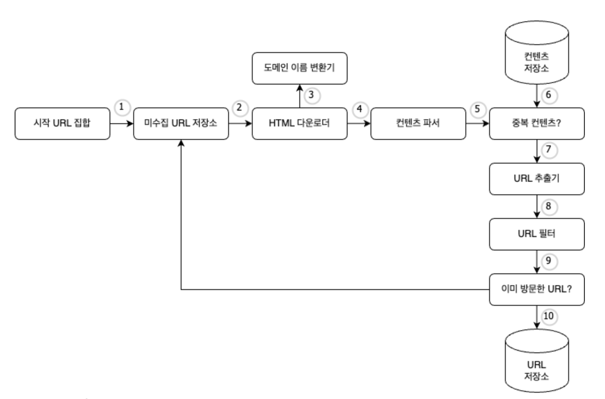
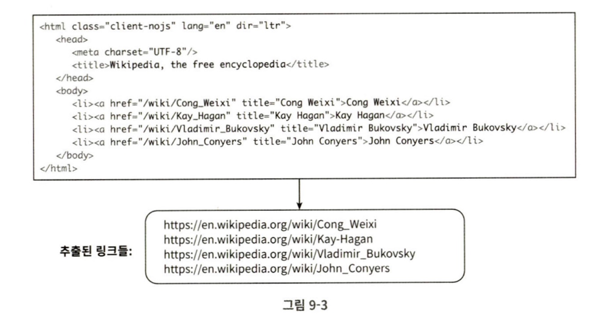
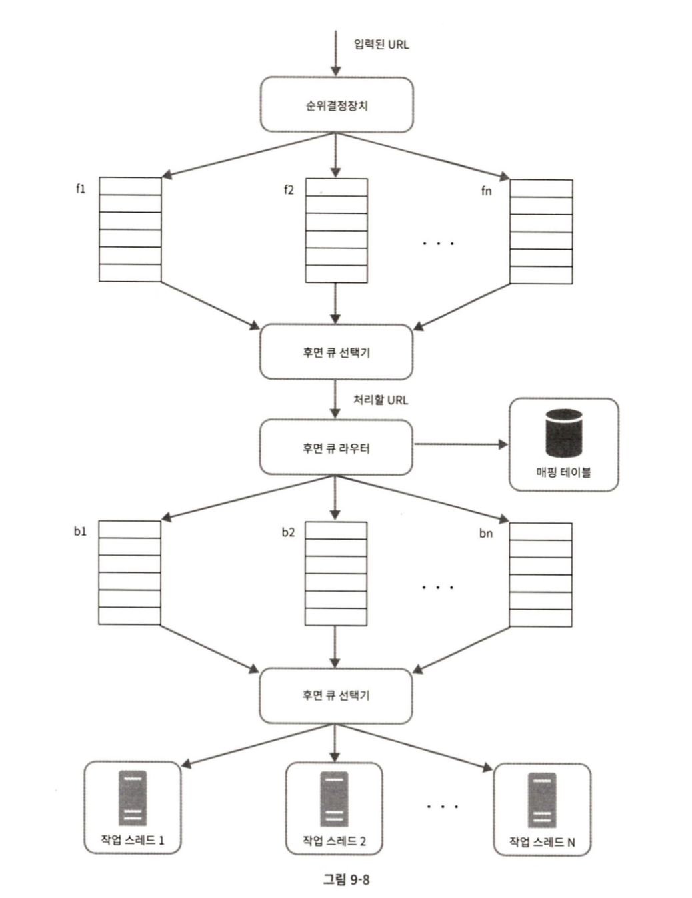
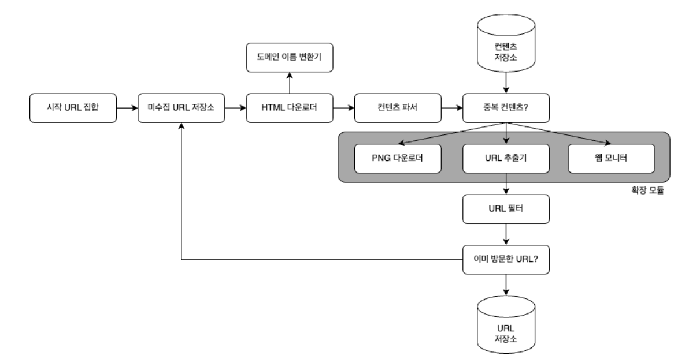

> 웹 크롤러  = 로봇 or 스파이더
> 
- 검색 엔진에서 널리 쓰는 기술.
- 웹에 새로 올라오거나 갱신된 콘텐츠를 찾아내는 것이 주된 목적.
- 콘텐츠 대상 → 웹 페이지, 이미지, 비디오, PDF 파일 등
- 몇 개의 웹 페이지에서 시작하여 그 링크를 따라 나가면서 새로운 콘텐츠를 수집한다.

<aside>

1. 검색 엔진 인덱싱 
    - 가장 보편적인 용례
    - 웹 페이지를 모아 검색 엔진을 위한 로컬 인덱스를 만든다.
    - Googlebot → 구글 검색 엔진이 사용하는 웹 크롤러
2. 웹 아카이빙
    - 나중에 사용할 목적으로 장기보관하기 위해 웹에서 정보를 모으는 절차.
    - 많은 국립 도서관이 크롤러로 웹사이트를 아카이빙
    - 미국 국회 도서관, EU 웹 아카이브 등
3. 웹 마이닝
    - 인터넷에서 유용한 지식을 도출
    - 주주 총회 자료나 연차 보고서 등을 다운받아 기업의 핵심 사업 방향을 알아내기도함.
4. 웹 모니터링
    - 인터넷에서 저작권이나 상표권이 침해되는 사례를 모니터링
    - 디지마크 → 웹 크롤러로 해적판 저작물을 찾아내서 보고함
</aside>

---

### 문제 이해 및 설계 범위 확정

<aside>

1. URL 집합이 입력으로 주어지면, 해당 URL들이 가리키는 모든 웹 페이지를 다운로드함
2. 다운받은 웹페이지에서 URL들을 추출함
3. 추출된 URL들을 다운로드할 URL 목록에 추가하고 위의 과정을 처음부터 반복
</aside>

#### 주의 해야할 특성

> 
> 
> - 규모 확장성 → 웹에 수십억 개의 페이지가 존재하므로, 병렬적으로 처리 가능하도록 하기
> - 안정성 → 웹은 함정으로 가득함. 잘못 작성된 HTML, 아무 반응이 없는 서버, 장애, 악성코드가 붙어있는 링크 등, 비정상적인 입력과 환경에서 잘 대응
> - 예절 → 수집 대상 웹 사이트에 짧은 시간 동안 너무 많은 요청을 보내서는 안 된다.
> - 확장성 → 새로운 형태의 콘텐츠를 지원하기 쉬워야함.

#### 개략적 규모 추정

- 매달 10억 개의 웹 페이지를 다운로드
- QPS = 10억/30일/24시간/3600초 = 대략 400페이지/초
- 최대 QPS = 2 QPS = 800
- 웹 페이지 크기 평균 500K라고 가정
- 10억 페이지 * 500K = 500TB/월
- 1개월치 데이터를 보관하는데는 500TB, 5년간 보관하면 30PB의 저장 용량이 필요함

---

### 시작 URL 집합

- 웹 크롤러가 크롤링을 시작하는 출발점.

#### 미수집 URL 저장소

- 대부분의 현대적 웹 크롤러는 크롤링 상태를
    1. 다운로드할 URL
    2. 다운로드된 URL
    
    두가지로 나눠 관리한다.
    
- 다운로드할 URL을 관리하는 컴포넌트가 바로 미수집 URL저장소임
- FIFO 큐.

#### HTML 다운로더

- 인터넷에서 웹 페이지를 다운로드하는 컴포넌트

#### 도메인 이름 변환기

- 웹 페이지를 다운받으려며 URL → IP 변환 필요
- DNS 리졸버

#### 콘텐츠 파서

- 웹 페이지를 파싱하고 검증함.

#### 중복 콘텐츠인가?

- 29% 가량의 웹페이지 콘텐츠는 중복이다.
    - 같은 콘텐츠를 여러번 저장하게 될 수 있음.
    - 이를 해결하기 위해서 해시 자료 구조 도입 후 값을 비교

#### 콘텐츠 저장소

- HTML 문서를 보관하는 시스템
- 저장할 데이터의 유형, 크기, 저장소 접근 빈도, 데이터의 유효 기간 등을 종합 고려해서 기술 선택
    - 디스크 + 메모리 동시에 사용하는 저장소
    - 대부분의 콘텐츠 → 디스크에 저장 (양이 너무 많으므로)
    - 인기있는 콘텐츠 → 메모리에 두어 접근시간 축소

#### URL 추출기

- HTML 페이지를 파싱하여 링크들을 골라냄
- 상대경로 → 절대 경로로 변환

#### URL 필터

- 특정한 콘텐츠 타입이나 파일 확장자를 갖는 URL, 접속 시 오류가 발생하는 URL, 접근 제외 목록에 포함된 URL 등을 크롤링 대상에서 제외

#### 이미 방문한 URL?

- 이미 방문한 URL이나 미수집 URL 저장소에 보관된 URL을 추적할 수있도록 자료구조 도입
    - 서버 부하 줄이고, 무한루프 방지
    - 블룸 필터 OR 해시 테이블 사용

#### URL 저장소

- 이미 방문한 URL을 보관하는 저장소

---

### 웹 크롤러 작업 흐름

1. 시작 URL들을 미수집 URL 저장소에 저장
2. HTML 다운로더는 미수집 URL 저장소에서 URL 목록을 가져옴
3. 도메인 이름 변환기를 사용하여 URL의 IP 주소를 알아내고, 해당 IP 주소로 접속하여 웹 페이지 다운로드
4. 콘텐츠 파서 → 다운된 HTML 페이지를 파싱하여 올바른 형식을 갖춘 페이지 인지 검증
5. 콘텐츠 파싱과 검증이 끝나면 중복 콘텐츠 인지 확인하는 절차 개시
6. 중복 콘텐츠인지 확인하기 위해서, 해당 페이지가 이미 저장소에 있는지 확인
    1. 이미 있으면 처리하지 않고 버림
    2. 없으면 저장소에 저장한되 URL 추출기로 전달
7. URL 추출기는 해당 HTML 페이지에서 링크를 골라냄
8. 골라낸 링크를 URL 필터로 전달
9. 필터링이 끝나고 남은 URL만 중복 URL판별 단계로 전달
10. 이미 처리한 URL인지 확인하기 위해, URL 저장소에 보관된 URL인지 확인 - 있으면 버림
11. 저장소에 없는 URL은 URL 저장소에 저장 + 미수집 URL 저장소에도 전달

---

### 상세 설계

#### DFS를 쓸것인가? BFS를 쓸것인가?

보통 BFS를 사용, but 2가지 문제점이 있음.

- 한 페이지에서 나오는 링크는 상당수 같은 서버로 되돌아가므로, 병렬로 처리하면 서버에 수많은 요청이 가서 과부하에 걸리게 됨 → 예의 없는 크롤러
- 표준적 BFS 알고리즘은 URL 간에 우선순위를 두지 않음
    - 모든 웹 페이지가 같은 수준의 품질, 중요성을 갖지 않음.
    - 페이지 순위, 사용자 트래픽의 양, 업데이트 빈도 등 여러가지 척도에 비추어 우선순위를 구별해야함.

#### 미수집 URL 저장소

- 위의 문제를 쉽게 해결가능
- 여기서 예의를 갖춘 크롤러, URL 사이의 우선순위와 신선도를 구별하는 크롤러 구현 가능

#### 예의

- 웹 크롤러는 수집 대상 서버로 짧은 시간 안에 너무 많은 요청을 보내는 것을 삼가야함.
    - 너무 많은 요청 → 무례함 + Dos(Deinal-of-Service) 공격으로 간주됨
- 따라서, 동일 웹 사이트에 대해서는 한 번에 한페이지만 요청해야함.
    - 같은 웹 사이트의 페이지를 다운받는 태스크는 시간차를 두고 실행.
        - 웹사이트의 호스트명과 다운로드를 작업하는 스레드 사이의 관계를 유지
        - 각 다운로드 스레드는 별도 FIFO 큐를 가짐.

<aside>

- 큐 라우터 - 같은 호스트에 속한 url → 언제나 같은 큐로 가도록 보장
- 매핑 테이플 - 호스트 이름과 큐 사이의 관계를 보관하는 테이블
- FIFO큐 - 같은 호스트에 속한 URL은 언제나 같은 큐에 보관
- 큐 선택기 - 큐들을 순회하면서 큐에서 URL을 꺼내서 해당 큐에서 나온 URL을 다운로드하도록 지정된 작업 스레드에 전달
- 작업 스레드 - 전달된 URL을 다운로드하는 작업 수행. 순차적으로 처리되며 작업들 사이에 delay 둘수있음.
</aside>

#### 우선순위

- 유용성에 따라 URL의 우선순위를 나눌 때는 페이지 랭크, 트래픽 양, 갱신 빈도 등의 척도 사용.
- 순위 결정 장치로 URL을 우선순위를 정함

<aside>

- 순위결정장치 - URL을 입력 받아 우선순위를 계산한다
- 큐 - 우선 순위별로 큐가 하나씩 할당됨. 우선순위가 높으면 선택될 확률이 높아짐
- 큐 선택기 - 임의 큐에서 처리할 URL을 꺼내는 역할. 순위가 높은 큐에서 더 자주 꺼냄
</aside>

> 전면 큐 → 우선순위 결정 과정 처리
후면 큐 → 크롤러가 예의 바르게 동작하도록 보증
> 

---

#### 신선도

- 웹 페이지의 신선도를 유지하기 위해서 이미 다운로드한 페이지라도 주기적으로 다시 재수집해야함.
- 모든 URL을 재수집하기에는 많은 시간과 자원이 필요하므로 최적화하기위해
    - 웹 페이지의 변경 이력 활용
    - 우선순위 활용 - 중요한 페이지 더 자주

---

#### 미수집 URL 저장소를 위한 지속성 저장장치

- 검색 엔진을 위한 크롤러 → 처리해야하는 URL의 수가 수억 개 → 메모리 저장 불가 (안정성, 규모확장성 측면)
    - 전부 디스크에 저장하는것도 좋은 방법은 아님 (디스크 IO가 느려서 병목지점이 되기때문)
- 본 설계 → 대부분의 URL은 디스크로, 메모리 버퍼에 큐를 두어서 절충. 주기적으로 버퍼를 디스크에 기록

---

#### HTML 다운로더

- robots.txt
    - 로봇 제외 프로토콜.
    - 웹 사이트가 크롤러와 소통하는 표준적 방법.
        - 크롤러가 수집해도 되는 페이지 목록이 들어있음
        - 웹사이트를 긁어 가기 전에 해당 파일의 규칙을 먼저 확인해야함
    - 주기적으로 다운받아서 캐시에 보관 → 여러번 다운로드하는걸 방지

---

#### 성능 최적화

1. 분산 크롤링
    1. 크롤링 작업을 여러 서버에 분산
2. 도메인 이름 변환 결과 캐시
    - 도메인 이름 변환기(DNS resolver)는 크롤러 성능 병목중 하나임.
    - DNS 요청을 보내고 결과를 기다리는 작업이 동기적이기 때문.
    - DNS 요청 처리 → 보통 10ms~ 200ms
    - DNS 조회 결과로 얻어진 도메인 이름과 IP 주소 사이의 관계를 캐시에 보관 + 크론 잡을 주기적으로 돌려서 갱신
3. 지역성
    - 작업을 수행하는 서버를 지역별로 분산
    - 크롤링 서버가 크롤링 대상 서버와 지역적으로 가까우면 페이지 다운로드 시간이 줄어듦.
4. 짧은 타임아웃
    - 어떤 웹 서버는 응답이 느리거나 아예 응답하지 않음.
    - 대기 시간이 길어지면 좋지 않으므로, 최대 얼마나 기다릴지 미리 정해둠.

---

### 안정성

- 안정 해시
    - 다운로더 서버들에 부하를 분산할 때 적용가능
    - 다운로드 서버를 쉽게 추가하고 삭제 가능
- 크롤링 상태 및 수집 데이터 저장
    - 장애가 발생한 경우에도 쉽게 복구할 수 있도록.
    - 크롤링 상태와 수집된 데이터를 지속적 저장장치에 기록.
- 예외 처리
    - 에러가 발생해도 전체 시스템이 중단되지 않도록 처리
- 데이터 검증
    - 시스템 오류를 방지하기 위해서 중요

### 확장성

- 모듈을 끼워넣음으로써 새로운 콘텐츠를 지원
    - PNG 다운로더 → PNG 파일을 다운로드하는 플러그인
    - 웹 모니터 → 웹을 모니터링하여 저작권이나 상표권 침해 방지

---

### 문제 있는 콘텐츠 감지 및 회피

1. 중복 콘텐츠
    - 웹 콘텐츠의 30%는 중복
    - 해시나 체크섬 사용해서 중복 탐지
2. 거미 덫
    - 크롤러를 무한 루프에 빠드리도록 설계한 웹 페이지
    - URL의 최대 길이를 제한하면 회피가능
    - 수작업으로 URL 필터 목록 추가도 가능
3. 데이터 노이즈
    - 가치 없는 콘텐츠
    - 광고, 스크립트 코드, 스팸 URL 등등 → 가능하다면 제외

---

### 더 생각해보면 좋은것

- 서버측 렌더링
    - 웹 사이트를 파싱하기 전에 서버 측 렌더링을 적용하면 동적으로 생성되는 링크를 발견가능
- 원치 않는 페이지 필터링
    - 스팸 방지 컴포넌트를 두어, 품질이 조악하거나 스팸성인 페이지 거
- 데이터 베이스 다중화 및 샤딩
- 수평적 규모 확장성
    - 무상태 서버로 만들기
- 가용성, 일관성, 안정성
    - CAP
- 데이터 분석 솔루션